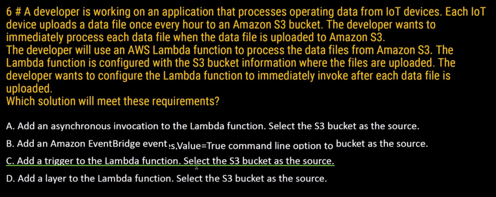
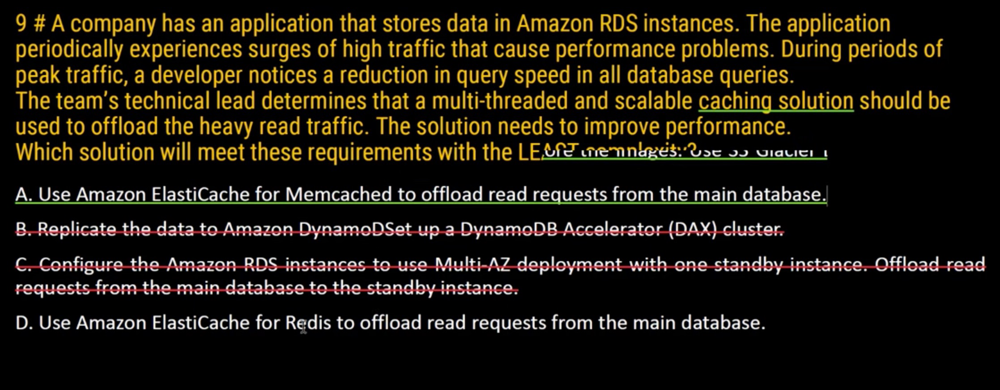
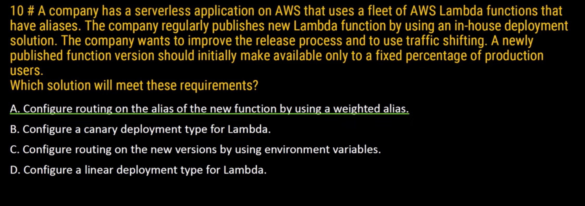
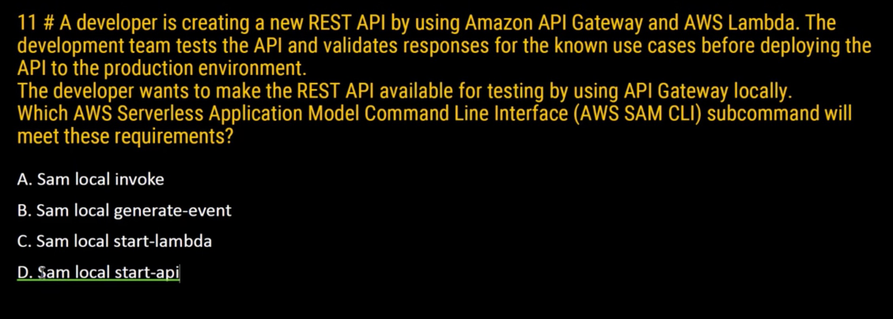
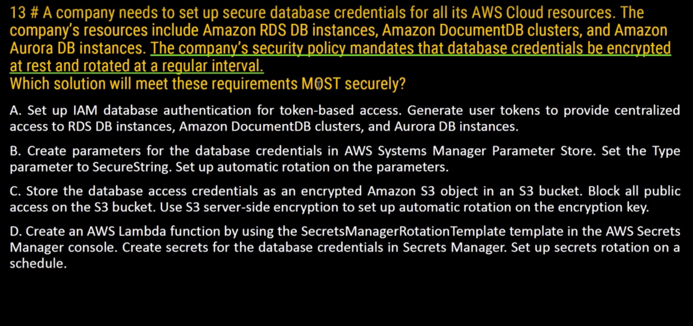
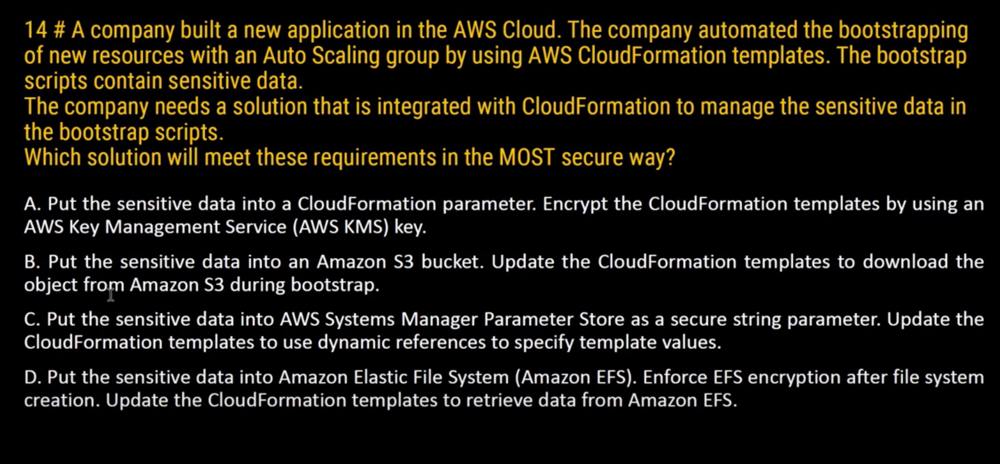
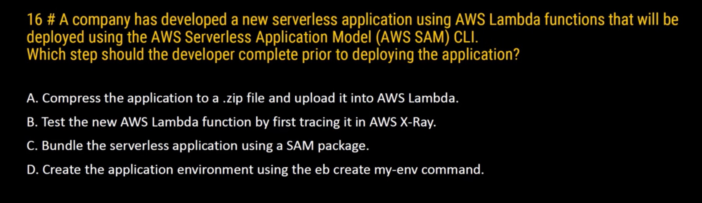

# aws-certification-notes

AWS certification notes
https://digitalcloud.training/category/aws-cheat-sheets/aws-developer-associate/?megamenu

## questions

These questions and answer are complied from here:
https://www.youtube.com/@sthithapragnakk
Please visit the site for more information and description.

## Questions 1

## Question 2

## Question 3

## Question 4

## Question 5

## Question 6

## Question 7

## Question 8

## Question 9

Memcached can be multithreaded.

<https://aws.amazon.com/elasticache/redis-vs-memcached/>

## Question 10

Canary deployment just help in weighted alias.

## Question 11

## Question 12

Answer: D

## Question 13

Answer: D

## Question 14

Answer: C

## Question 15

Answer: B

## Question 16

Answer:

## Question 16

Answer:
